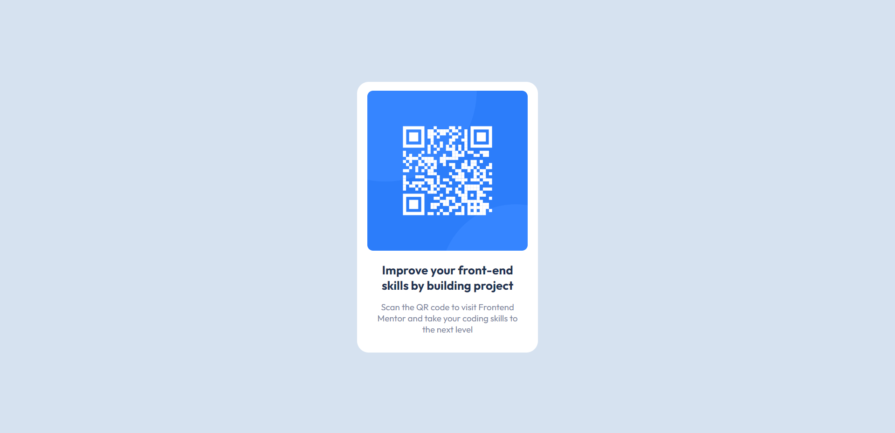

# Frontend Mentor - QR Code Component Solution

This is a solution to the [QR code component challenge on Frontend Mentor](https://www.frontendmentor.io/challenges/qr-code-component-iux_sIO_H). Frontend Mentor challenges help you improve your coding skills by building realistic projects.

## Table of Contents

- [Overview](#overview)
  - [Screenshot](#screenshot)
  - [Links](#links)
  - [Built With](#built-with)
  - [What I Learned](#what-i-learned)

## Overview

### Screenshot



### Links

- [Solution URL](https://github.com/johnEdmon44/qr-code)
- [Live Site URL](https://johnedmon44.github.io/qr-code/)


### Built With

- HTML
- CSS

### What I Learned

In this project, I learned how to use Flexbox to position elements effectively. Here's a snippet of the CSS code that showcases my usage of Flexbox:

```css
/* Reset CSS */
*, *::after, *::before {
  box-sizing: border-box;
  margin: 0;
  padding: 0;
  font-family: 'Outfit', sans-serif;
}

/* Body and container styling */
body {
  background-color: hsl(212, 45%, 89%);
  display: flex;
  justify-content: center;
  align-items: center;
  min-height: 100vh;
  font-size: 15px;
}

.container {
  background-color: white;
  display: flex;
  justify-content: center;
  align-items: center;
  flex-direction: column;
  text-align: center;
  border-radius: 20px;
  width: 310px;
}
```